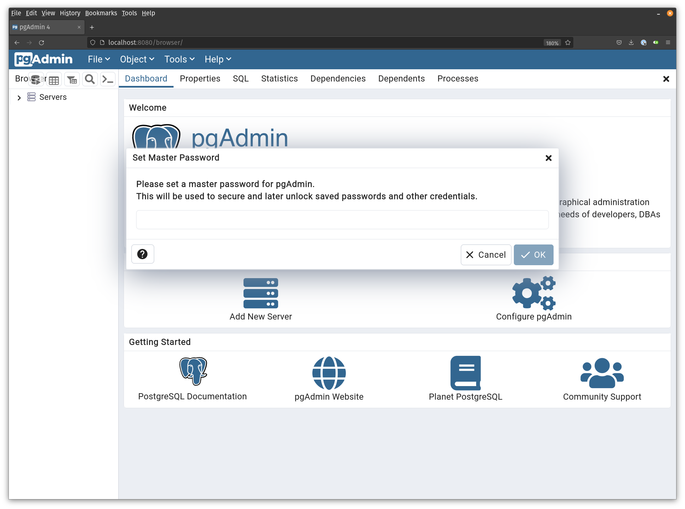

# Docker Compose

## Challenge

Run the following:

- A container for the API.
- A container to host the PostgreSQL database.
- Another container running pgadmin4 (Admin tool for PostgreSQL)

Something like this:


## Solution


### TL;DR


### The long way

**Docker compose file**

```yaml
version: '3'

services:
  db:
    image: postgres
    container_name: my-postgres-host
    restart: always
    environment:
      - POSTGRES_PASSWORD=my-secret-password
    ports:
      - '5432:5432'
    networks:
      - growthdays

  pgadmin:
    image: dpage/pgadmin4
    container_name: my-pgadmin-host
    environment:
      PGADMIN_DEFAULT_EMAIL: mauricio.araya@praxent.com
      PGADMIN_DEFAULT_PASSWORD: HelloWorld
      PGADMIN_CONFIG_SERVER_MODE: 'False'
    ports:
      - "8080:80"
    networks:
      - growthdays

  webapi:
    container_name: my-web-api
    image: containerplayground/webapi:latest
    environment:
      DB_USER: postgres
      DB_HOST: my-postgres-host
      DB_NAME: user_db
      DB_PASSWORD: my-secret-password
    ports:
      - "3000:3000"
    networks:
      - growthdays
networks:
  growthdays: # name: growthdays

```

### Kick docker compose

```bash
docker compose up -d
```

### Test your environment

#### List your running containers

```bash
docker ps
```

#### Ping the API

```bash
curl http://localhost:3000
```

#### Kill the containers

```bash
docker kill my-web-api
```
### Shut everything down

```bash
docker compose up
```
---

### Database setup

Open your browser and go to: http://localhost:8080/browser/, you might be prompted to enter a master password, type whatever you can remember.




Once you are in, from the `Browser` section (on the left), right click on `Servers`, then choose `Register`, then `Server`. A window will pop up, fill the following fields:

- In the `General` tab, enter "my-pg-server" in the `Name` field.
- In the `Connection` tab, on the `Host` field, enter "my-postgres-host". This is the same `container_name` defined in your `docker-compose.yml` file.
- `Username` must be `postgres`
- `Password` must be `my-secret-password`. The same we have in our `docker-compose.yml`.
- Turn on `Save password`.

This is how it should look like:


---

**Create the database**

Using `PGAdmin` create a new database called `user_db`.

**Create the table**

Right click on your newly created database, and click on `Query Tool`. Run the following SQL script:

```sql
-- Create the users table
CREATE TABLE users (
  ID SERIAL PRIMARY KEY,
  name VARCHAR(30),
  email VARCHAR(30)
);

-- Insert a couple of records
INSERT INTO users (name, email)
   VALUES ('John', 'john@example.com'),
          ('Marie', 'marie@example.com');

-- Query the records
SELECT * from users;

```

Hit the run button (▶). This should look like this:


**Play with the API**

Run the following command:

```bash
curl http://localhost:3000/users
```

You'll get something like this:

```json
[{"id":1,"name":"John","email":"john@example.com"},{"id":2,"name":"Marie","email":"marie@example.com"}]
```

If you have JQ installed on your system, you can run:

```bash
curl http://localhost:3000/users | jq
```

And you'll get a formatted JSON output:

```json
[
  {
    "id": 1,
    "name": "John",
    "email": "john@example.com"
  },
  {
    "id": 2,
    "name": "Marie",
    "email": "marie@example.com"
  }
]
```
