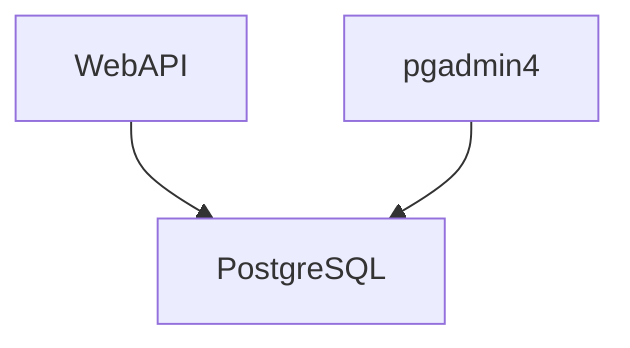

# Kubernetes

## Challenge

Run the following:

- A container for the API.
- A container to host the PostgreSQL database.
- Another container running pgadmin4 (Admin tool for PostgreSQL)

Something like this:



## Solution

### Start minikube

```bash
minikube start
```

### Launch your containers

```bash
bash kubectl apply -f db-deployment.yml
```

```bash
bash kubectl apply -f db-service.yml
```

```bash
bash kubectl apply -f pgadmin-deployment.yml
```

```bash
bash kubectl apply -f pgadmin-service.yml
```

```bash
bash kubectl apply -f webapi-deployment.yml
```

```bash
bash kubectl apply -f webapi-service.yml
```

### Check your environment

```bash
kubectl get all
```

You should see something like this:

```
NAME                          READY   STATUS    RESTARTS   AGE
pod/db-5cbf66dc94-nhz5d       1/1     Running   0          35s
pod/pgadmin-6f48b7965-xjhxx   1/1     Running   0          35s
pod/webapi-bc56bd86b-dk5fz    1/1     Running   0          35s

NAME                 TYPE        CLUSTER-IP      EXTERNAL-IP   PORT(S)          AGE
service/db           ClusterIP   10.105.116.40   <none>        5432/TCP         35s
service/kubernetes   ClusterIP   10.96.0.1       <none>        443/TCP          20d
service/pgadmin      NodePort    10.96.23.165    <none>        8080:31000/TCP   35s
service/webapi       NodePort    10.99.113.34    <none>        3000:30000/TCP   34s

NAME                      READY   UP-TO-DATE   AVAILABLE   AGE
deployment.apps/db        1/1     1            1           35s
deployment.apps/pgadmin   1/1     1            1           35s
deployment.apps/webapi    1/1     1            1           35s

NAME                                DESIRED   CURRENT   READY   AGE
replicaset.apps/db-5cbf66dc94       1         1         1       35s
replicaset.apps/pgadmin-6f48b7965   1         1         1       35s
replicaset.apps/webapi-bc56bd86b    1         1         1       35s

```

### Enable access to your services

```bash
minikube service webapi --url
```

```bash
minikube service pgadmin --url
```

### Ping the API

Run the following command (you might need to change the url depending on the output of commands from the previous section):

```bash
curl http://192.168.49.2:30000
```

You should get something like this:

```json
{
  "info": "Node + Express + Postgres => API"
}
```

### Delete everything

```bash
kubectl delete -f db-deployment.yml
```

```bash
bash kubectl delete -f db-service.yml
```

```bash
kubectl delete -f pgadmin-deployment.yml
```

```bash
kubectl delete -f pgadmin-service.yml
```

```bash
kubectl delete -f webapi-deployment.yml
```

```bash
kubectl delete -f webapi-service.yml
```
