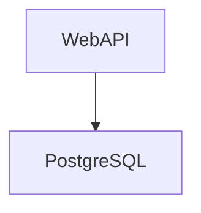
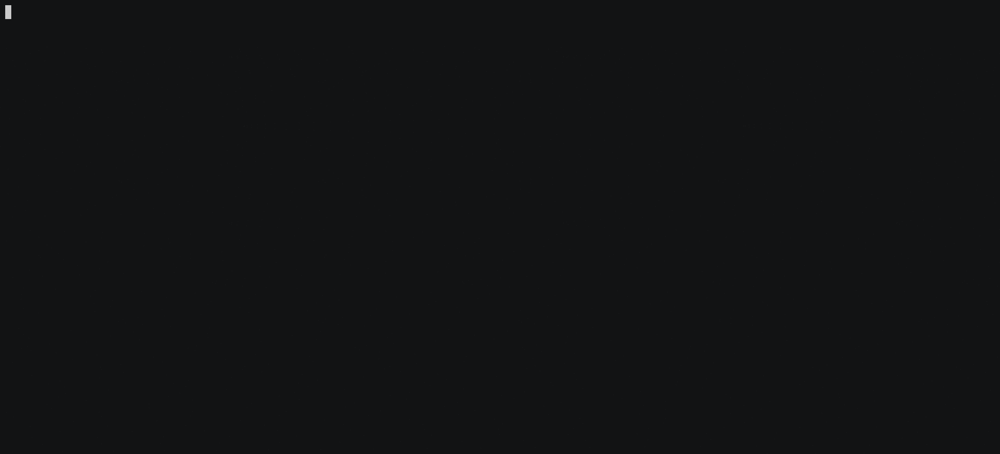

# Web API

## Architecture

The webapi, is a simple API that is backed by a PostgreSQL database. Graphically:




## Challenge

Write a `Dockerfile` so it can run on a docker container.
## Solution

### TL;DR


### The long way

**Dockerfile**

```yaml
FROM node:16.18.0

RUN mkdir -p /app

COPY src app/src

WORKDIR /app/src

RUN npm install -g npm

RUN npm install

EXPOSE 3000

CMD [ "node", "index.js" ]
```


```bash
docker build . -t webapi:latest
```

### Test the image

#### Launch a container

```bash
docker run --rm -d -p 3000:3000 --name my-web-api -d webapi
```

#### List your running containers

```bash
docker ps
```

#### Ping the API

```bash
curl http://localhost:3000
```

#### Kill the container

```bash
docker kill my-web-api
```
